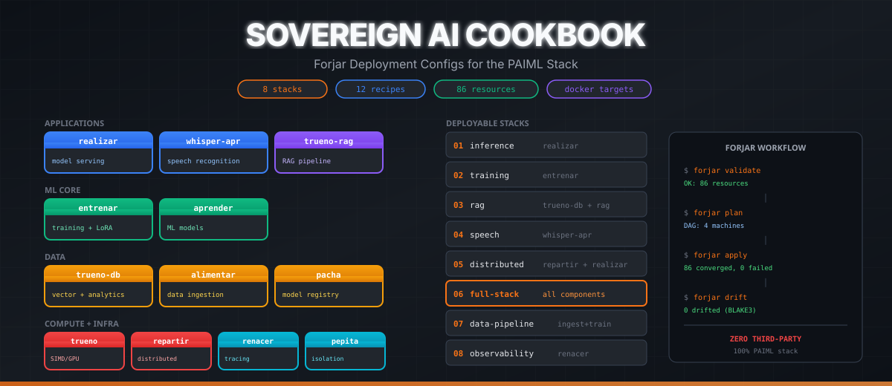

<!-- AUTO-GENERATED by scripts/generate-readme.sh — do NOT edit manually.
     To change this file, edit scripts/generate-readme.sh and push to main.
     The generate-readme workflow will regenerate and commit. -->

<p align="center">
  
</p>

<p align="center">
  <strong>Forjar deployment configs for the complete PAIML sovereign AI stack.</strong><br/>
  17 Rust components -- 10 deployment stacks -- 14 recipes -- zero third-party runtime dependencies.
</p>

---

## Table of Contents

- [Status Dashboard](#status-dashboard)
- [Installation](#installation)
- [Quick Start](#quick-start)
- [Stacks](#stacks)
- [Sovereign Stack Components](#sovereign-stack-components)
- [Nightly Binary Releases](#nightly-binary-releases)
- [Architecture](#architecture)
- [Recipes](#recipes)
- [Testing](#testing)
- [Production Deployment](#production-deployment)
- [How to Update](#how-to-update)
- [Contributing](#contributing)
- [Related Repositories](#related-repositories)
- [License](#license)

---

## Status Dashboard

All CI and nightly build status across the sovereign stack.

| Component | Binary | CI | Nightly |
|-----------|--------|----|---------|
| [realizar](https://github.com/paiml/realizar) | `realizar` | [](https://github.com/paiml/realizar/actions/workflows/ci.yml) | [](https://github.com/paiml/realizar/releases/tag/nightly) |
| [aprender](https://github.com/paiml/aprender) | `apr` | [](https://github.com/paiml/aprender/actions/workflows/ci.yml) | [](https://github.com/paiml/aprender/releases/tag/nightly) |
| [trueno](https://github.com/paiml/trueno) | `trueno-monitor` | [](https://github.com/paiml/trueno/actions/workflows/ci.yml) | [](https://github.com/paiml/trueno/releases/tag/nightly) |
| [trueno-rag](https://github.com/paiml/trueno-rag) | `trueno-rag` | [](https://github.com/paiml/trueno-rag/actions/workflows/ci.yml) | [](https://github.com/paiml/trueno-rag/releases/tag/nightly) |
| [entrenar](https://github.com/paiml/entrenar) | `entrenar` | [](https://github.com/paiml/entrenar/actions/workflows/ci.yml) | [](https://github.com/paiml/entrenar/releases/tag/nightly) |
| [alimentar](https://github.com/paiml/alimentar) | `alimentar` | [](https://github.com/paiml/alimentar/actions/workflows/ci.yml) | [](https://github.com/paiml/alimentar/releases/tag/nightly) |
| [batuta](https://github.com/paiml/batuta) | `batuta` | [](https://github.com/paiml/batuta/actions/workflows/ci.yml) | [](https://github.com/paiml/batuta/releases/tag/nightly) |
| [forjar](https://github.com/paiml/forjar) | `forjar` | [](https://github.com/paiml/forjar/actions/workflows/ci.yml) | [](https://github.com/paiml/forjar/releases/tag/nightly) |
| [paiml-mcp-agent-toolkit](https://github.com/paiml/paiml-mcp-agent-toolkit) | `pmat` | [](https://github.com/paiml/paiml-mcp-agent-toolkit/actions/workflows/ci.yml) | [](https://github.com/paiml/paiml-mcp-agent-toolkit/releases/tag/nightly) |
| [copia](https://github.com/paiml/copia) | `copia` | [](https://github.com/paiml/copia/actions/workflows/ci.yml) | [](https://github.com/paiml/copia/releases/tag/nightly) |
| [pzsh](https://github.com/paiml/pzsh) | `pzsh` | [](https://github.com/paiml/pzsh/actions/workflows/ci.yml) | [](https://github.com/paiml/pzsh/releases/tag/nightly) |
| [renacer](https://github.com/paiml/renacer) | `renacer` | [](https://github.com/paiml/renacer/actions/workflows/ci.yml) | [](https://github.com/paiml/renacer/releases/tag/nightly) |
| [repartir](https://github.com/paiml/repartir) | `repartir` | [](https://github.com/paiml/repartir/actions/workflows/jidoka-gates.yml) | [](https://github.com/paiml/repartir/releases/tag/nightly) |
| [whisper.apr](https://github.com/paiml/whisper.apr) | `whisper-apr` | [](https://github.com/paiml/whisper.apr/actions/workflows/ci.yml) | [](https://github.com/paiml/whisper.apr/releases/tag/nightly) |
| [pepita](https://github.com/paiml/pepita) | `pepita` | [](https://github.com/paiml/pepita/actions/workflows/jidoka-gates.yml) | [](https://github.com/paiml/pepita/releases/tag/nightly) |
| [simular](https://github.com/paiml/simular) | `simular` | [](https://github.com/paiml/simular/actions/workflows/ci.yml) | [](https://github.com/paiml/simular/releases/tag/nightly) |
| [pacha](https://github.com/paiml/pacha) | `pacha` | [](https://github.com/paiml/pacha/actions/workflows/ci.yml) | [](https://github.com/paiml/pacha/releases/tag/nightly) |

---

## Installation

```bash
# Clone the cookbook
git clone https://github.com/paiml/sovereign-ai-cookbook
cd sovereign-ai-cookbook

# Install forjar (the deployment engine)
cargo install forjar

# Or download a nightly binary
curl -L -o forjar https://github.com/paiml/forjar/releases/download/nightly/forjar-x86_64-unknown-linux-musl
chmod +x forjar && mv forjar ~/.cargo/bin/
```

## Quick Start

```bash
git clone https://github.com/paiml/sovereign-ai-cookbook
cd sovereign-ai-cookbook

# Validate a stack config
forjar validate -f stacks/01-inference/forjar.yaml

# Plan (dry-run — shows resource DAG)
forjar plan -f stacks/01-inference/forjar.yaml

# Apply (deploys to ephemeral docker containers)
forjar apply -f stacks/01-inference/forjar.yaml

# Check for drift (BLAKE3 verification)
forjar drift -f stacks/01-inference/forjar.yaml
```

## Stacks

Each stack is a complete, deployable `forjar.yaml` targeting docker containers. Swap `transport: container` to `ssh` for production.

| Stack | What it deploys | Components | Resources |
|-------|-----------------|------------|-----------|
| [01-inference](stacks/01-inference/) | Single-machine model serving | realizar | 11 |
| [02-training](stacks/02-training/) | GPU training pipeline | entrenar | 9 |
| [03-rag](stacks/03-rag/) | Retrieval-augmented generation | trueno-db, trueno-rag, realizar | 35 |
| [04-speech](stacks/04-speech/) | Speech recognition | whisper-apr | 10 |
| [05-distributed-inference](stacks/05-distributed-inference/) | Multi-node inference | repartir, realizar | 22 |
| **[06-full-stack](stacks/06-full-stack/)** | **Complete sovereign AI lab** | **all components** | **86** |
| [07-data-pipeline](stacks/07-data-pipeline/) | Ingest, train, serve | alimentar, entrenar, realizar | 29 |
| [08-observability](stacks/08-observability/) | Monitoring and tracing | renacer, Jaeger, Grafana | 10 |
| [09-edge-inference](stacks/09-edge-inference/) | Jetson Orin Nano edge inference | realizar, trueno | 18 |
| [09-qwen-coder](stacks/09-qwen-coder/) | Local coding assistant | aprender (apr-cli) | 16 |

### Clean-Room Test Matrix

<!-- STACK_MATRIX_START -->

**Stack Matrix** — 0/1 pass, 1 fail (updated: 2026-04-20 20:22 UTC)

| Stack | Status | Apply | Idempotent | Resources | Duration |
|-------|--------|-------|------------|-----------|----------|
| 01-inference | FAIL | FAIL | — | 1 | 1m24s |
<!-- STACK_MATRIX_END -->

## Sovereign Stack Components

Every component is a standalone Rust binary with zero third-party runtime dependencies. All are published to [crates.io](https://crates.io) and built nightly from `main`.

| Component | Binary | Version | Layer | Description | crates.io |
|-----------|--------|---------|-------|-------------|-----------|
| [realizar](https://github.com/paiml/realizar) | `realizar` | v0.8 | Application | Model serving (GGUF, SafeTensors, CUDA) | [realizar](https://crates.io/crates/realizar) |
| [aprender](https://github.com/paiml/aprender) | `apr` | v0.27 | ML Core | Model inspection, inference, training CLI | [aprender](https://crates.io/crates/aprender) |
| [trueno](https://github.com/paiml/trueno) | `trueno-monitor` | v0.16 | Compute | SIMD/GPU engine + TUI monitor | [trueno](https://crates.io/crates/trueno) |
| [trueno-rag](https://github.com/paiml/trueno-rag) | `trueno-rag` | v0.2 | Application | RAG pipeline (embed, index, query) | [trueno-rag](https://crates.io/crates/trueno-rag) |
| [entrenar](https://github.com/paiml/entrenar) | `entrenar` | v0.7 | ML Core | Training engine (LoRA, QLoRA, classification) | [entrenar](https://crates.io/crates/entrenar) |
| [alimentar](https://github.com/paiml/alimentar) | `alimentar` | v0.2 | Data | Ingestion, preprocessing, dedup | [alimentar](https://crates.io/crates/alimentar) |
| [batuta](https://github.com/paiml/batuta) | `batuta` | v0.6 | Infra | Orchestration, mutation testing, oracle | [batuta](https://crates.io/crates/batuta) |
| [forjar](https://github.com/paiml/forjar) | `forjar` | v0.5 | Infra | Infrastructure-as-Code provisioning | [forjar](https://crates.io/crates/forjar) |
| [paiml-mcp-agent-toolkit](https://github.com/paiml/paiml-mcp-agent-toolkit) | `pmat` | v0.4 | Infra | Code quality, work tracking, coverage | [pmat](https://crates.io/crates/pmat) |
| [copia](https://github.com/paiml/copia) | `copia` | v0.1 | Infra | Sovereign file sync | [copia](https://crates.io/crates/copia) |
| [pzsh](https://github.com/paiml/pzsh) | `pzsh` | v0.1 | Infra | Sub-10ms shell framework | [pzsh](https://crates.io/crates/pzsh) |
| [renacer](https://github.com/paiml/renacer) | `renacer` | v0.10 | Infra | Syscall tracing, Jaeger, Grafana | [renacer](https://crates.io/crates/renacer) |
| [repartir](https://github.com/paiml/repartir) | `repartir` | v2.0 | Compute | Distributed execution workers | [repartir](https://crates.io/crates/repartir) |
| [whisper.apr](https://github.com/paiml/whisper.apr) | `whisper-apr` | v0.2 | Application | Speech recognition (Whisper) | [whisper-apr](https://crates.io/crates/whisper-apr) |
| [pepita](https://github.com/paiml/pepita) | `pepita` | v0.1 | Infra | Kernel namespace isolation, seccomp | [pepita](https://crates.io/crates/pepita) |
| [simular](https://github.com/paiml/simular) | `simular` | v0.3 | Infra | Simulation engine | [simular](https://crates.io/crates/simular) |
| [pacha](https://github.com/paiml/pacha) | `pacha` | v0.2 | Data | Model/data registry, BLAKE3 checksums | [pacha](https://crates.io/crates/pacha) |

## Nightly Binary Releases

Every component ships cross-platform nightly binaries built from `main` via GitHub Actions. Binaries are statically linked (musl on Linux) and require no runtime dependencies.

| Binary | Repo | Layer | Description | Platforms |
|--------|------|-------|-------------|-----------|
| `realizar` | [realizar](https://github.com/paiml/realizar) | Application | Model serving (GGUF, SafeTensors, CUDA) | Linux, macOS, Windows |
| `apr` | [aprender](https://github.com/paiml/aprender) | ML Core | Model inspection, inference, training CLI | Linux, macOS, Windows |
| `trueno-monitor` | [trueno](https://github.com/paiml/trueno) | Compute | SIMD/GPU engine + TUI monitor | Linux |
| `trueno-rag` | [trueno-rag](https://github.com/paiml/trueno-rag) | Application | RAG pipeline (embed, index, query) | Linux, macOS, Windows |
| `entrenar` | [entrenar](https://github.com/paiml/entrenar) | ML Core | Training engine (LoRA, QLoRA, classification) | Linux, macOS, Windows |
| `alimentar` | [alimentar](https://github.com/paiml/alimentar) | Data | Ingestion, preprocessing, dedup | Linux, macOS, Windows |
| `batuta` | [batuta](https://github.com/paiml/batuta) | Infra | Orchestration, mutation testing, oracle | Linux, macOS, Windows |
| `forjar` | [forjar](https://github.com/paiml/forjar) | Infra | Infrastructure-as-Code provisioning | Linux, macOS, Windows |
| `pmat` | [paiml-mcp-agent-toolkit](https://github.com/paiml/paiml-mcp-agent-toolkit) | Infra | Code quality, work tracking, coverage | Linux, macOS, Windows |
| `copia` | [copia](https://github.com/paiml/copia) | Infra | Sovereign file sync | Linux, macOS, Windows |
| `pzsh` | [pzsh](https://github.com/paiml/pzsh) | Infra | Sub-10ms shell framework | Linux, macOS, Windows |
| `renacer` | [renacer](https://github.com/paiml/renacer) | Infra | Syscall tracing, Jaeger, Grafana | Linux, macOS, Windows |
| `repartir` | [repartir](https://github.com/paiml/repartir) | Compute | Distributed execution workers | Linux, macOS, Windows |
| `whisper-apr` | [whisper.apr](https://github.com/paiml/whisper.apr) | Application | Speech recognition (Whisper) | Linux, macOS, Windows |
| `pepita` | [pepita](https://github.com/paiml/pepita) | Infra | Kernel namespace isolation, seccomp | Linux, macOS, Windows |
| `simular` | [simular](https://github.com/paiml/simular) | Infra | Simulation engine | Linux, macOS, Windows |
| `pacha` | [pacha](https://github.com/paiml/pacha) | Data | Model/data registry, BLAKE3 checksums | Linux, macOS, Windows |

> **Install any binary:**
> ```bash
> # Download from nightly release (example: forjar on Linux x86_64)
> curl -L -o forjar https://github.com/paiml/forjar/releases/download/nightly/forjar-x86_64-unknown-linux-musl
> chmod +x forjar && mv forjar ~/.cargo/bin/
>
> # Or provision automatically via forjar (type: github_release)
> forjar apply -f stacks/06-full-stack/forjar.yaml
> ```

## Architecture

```
                    ┌──────────────────┐
                    │   monitor-box    │
                    │  renacer tracing │
                    │  Grafana + Jaeger│
                    │  pacha registry  │
                    └────────┬─────────┘
                             │
            ┌────────────────┼────────────────┐
            │                │                │
     ┌──────▼──────┐  ┌─────▼──────┐  ┌─────▼──────┐
     │   gpu-box   │  │  rag-box   │  │ worker-box │
     │  realizar   │  │ trueno-db  │  │  repartir  │
     │  entrenar   │  │ trueno-rag │  │  worker    │
     │             │  │ whisper-apr│  │            │
     └─────────────┘  └────────────┘  └────────────┘
```

All stacks use `transport: container` with ephemeral docker containers. Forjar creates the container, applies all resources (packages, files, services, firewall rules, cron jobs), verifies convergence with BLAKE3 hashing, and tears down after testing.

See [docs/architecture.md](docs/architecture.md) for data flow diagrams and port assignments.

## Recipes

Reusable building blocks in [`recipes/`](recipes/). Each recipe is machine-agnostic -- stacks bind them to specific machines.

| Recipe | Component | What it configures |
|--------|-----------|-------------------|
| [`realizar-serve`](recipes/realizar-serve.yaml) | realizar | GPU model serving (GGUF, safetensors), systemd unit, firewall, health check |
| [`entrenar-train`](recipes/entrenar-train.yaml) | entrenar | Training config (learning rate, epochs, LoRA rank), GPU setup, checkpoints |
| [`trueno-rag-pipeline`](recipes/trueno-rag-pipeline.yaml) | trueno-rag | Embedding + retrieval pipeline, backed by trueno-db |
| [`trueno-db-analytics`](recipes/trueno-db-analytics.yaml) | trueno-db | Analytics/vector database, WAL, compaction |
| [`alimentar-ingest`](recipes/alimentar-ingest.yaml) | alimentar | Data ingestion, preprocessing, dedup, scheduled cron |
| [`whisper-apr-asr`](recipes/whisper-apr-asr.yaml) | whisper-apr | ASR service, model download, VAD, beam search |
| [`pacha-registry`](recipes/pacha-registry.yaml) | pacha | Model/data registry, BLAKE3 checksums, GC |
| [`pepita-sandbox`](recipes/pepita-sandbox.yaml) | pepita | Kernel namespace isolation, overlay filesystem, seccomp |
| [`repartir-worker`](recipes/repartir-worker.yaml) | repartir | Distributed execution worker, TLS, systemd |
| [`renacer-observability`](recipes/renacer-observability.yaml) | renacer | Syscall tracing, Jaeger, Grafana, OTLP |
| [`batuta-agent`](recipes/batuta-agent.yaml) | batuta | Autonomous agent runtime, mutation testing daemon |
| [`jetson-edge-base`](recipes/jetson-edge-base.yaml) | (platform) | Jetson Orin Nano base: JetPack CUDA, Rust toolchain, sovereign tools |
| [`sovereign-ai-stack`](recipes/sovereign-ai-stack.yaml) | (meta) | Fleet coordination, health dashboard, inventory |
| [`apr-inference-server`](recipes/apr-inference-server.yaml) | aprender | GPU inference with model download, BLAKE3 verification |

## Testing

All stacks deploy to ephemeral docker containers — no SSH, no root, no real hardware required.

```bash
# Validate all stacks
make validate

# Plan all stacks (shows resource DAGs)
make plan

# Validate a single stack
make validate-one STACK=03-rag

# Apply a single stack
make apply-one STACK=01-inference

# Check drift after manual changes
make drift-one STACK=01-inference
```

## Production Deployment

Replace container transport with SSH for real machines:

```yaml
machines:
  gpu-box:
    hostname: gpu-prod-01.internal
    addr: 10.0.1.10
    user: deploy
    arch: x86_64
    ssh_key: ~/.ssh/deploy_key
    roles: [gpu-compute, inference]
```

Use `policy.parallel_machines: true` for concurrent multi-machine deployment. Use `policy.serial: 1` for rolling deploys.

## How to Update

README.md is **auto-generated**. Never edit it directly.

| What to change | Where to edit | How it deploys |
|----------------|---------------|----------------|
| README content, layout, badges | `scripts/generate-readme.sh` | Push to main → workflow regenerates |
| Stack test matrix | *(automatic)* | Clean-room CI injects results between `STACK_MATRIX` markers |
| Component versions, layers, descriptions | `COMPONENTS` array in `scripts/generate-readme.sh` | Push to main → workflow regenerates |
| CI + nightly badges | *(automatic)* | Generated from `COMPONENTS` array |
| Component table, nightly links | *(automatic)* | Generated from `COMPONENTS` array |

```bash
# Preview locally
./scripts/generate-readme.sh

# CI check mode (fails if README.md is stale)
./scripts/generate-readme.sh --check
```

## Contributing

Contributions are welcome. To get started:

1. Fork the repository
2. Create a stack or recipe in the appropriate directory
3. Validate with `make validate`
4. Submit a pull request

All stack configs must pass `forjar validate` before merge. See [How to Update](#how-to-update) for README changes.

## Related Repositories

| Project | Purpose | Link |
|---------|---------|------|
| [forjar](https://github.com/paiml/forjar) | Infrastructure as Code (deploys this cookbook) | [Book](https://github.com/paiml/forjar/tree/main/docs/book) |
| [aprender](https://github.com/paiml/aprender) | ML library (models, inference, training) | [crates.io](https://crates.io/crates/aprender) |
| [trueno](https://github.com/paiml/trueno) | SIMD/GPU compute engine (pure Rust PTX) | [crates.io](https://crates.io/crates/trueno) |
| [realizar](https://github.com/paiml/realizar) | Model serving (GGUF, SafeTensors, CUDA) | [crates.io](https://crates.io/crates/realizar) |
| [entrenar](https://github.com/paiml/entrenar) | Training engine (LoRA, QLoRA) | [crates.io](https://crates.io/crates/entrenar) |
| [trueno-rag](https://github.com/paiml/trueno-rag) | RAG pipeline (embed, index, query) | [crates.io](https://crates.io/crates/trueno-rag) |
| [batuta](https://github.com/paiml/batuta) | Orchestration, mutation testing, oracle | [crates.io](https://crates.io/crates/batuta) |
| [paiml-mcp-agent-toolkit](https://github.com/paiml/paiml-mcp-agent-toolkit) | Code quality, work tracking, coverage | [crates.io](https://crates.io/crates/pmat) |
| [apr-cookbook](https://github.com/paiml/apr-cookbook) | 202 Rust ML code examples | [Examples](https://github.com/paiml/apr-cookbook/tree/main/examples) |

## License

MIT
